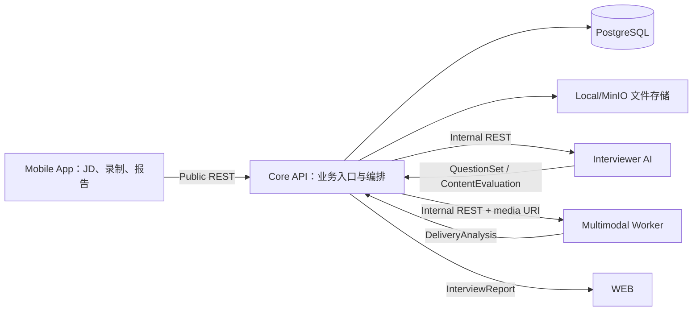

# MVP 系统架构

## 1. 需求与成功标准

### 功能需求

- 根据一段 JD 生成固定数量的结构化问题。
- 移动端 App 逐题录制回答并上传。
- 对回答内容和表达特征分别分析。
- 聚合为逐题反馈和整场报告。
- 失败任务可重试，前端能显示明确状态。

### 非功能需求

- 单人完整面试可在普通开发机或一台 GPU 服务上演示。
- 问题生成目标 30 秒内完成；单题离线分析目标 90 秒内完成。
- 原始音视频默认只保留 MVP 配置指定的短周期，并支持删除。
- 服务日志不得记录 JD 全文、回答全文、音视频内容或签名文件地址。
- 任一 AI 子服务失败时，其他数据仍可保留并允许重试。

## 2. 架构选择

采用模块化单仓库，由 Core API 统一编排。Interviewer AI 和 Multimodal 以独立进程运行，但只暴露内部接口。这样四人可以并行开发，又不会让前端承担模型编排。

MVP 可先用 SQLite 和本地文件目录，但模块必须通过存储接口访问，避免后续切换 PostgreSQL/MinIO 时修改业务逻辑。

## 3. 模块边界

### Mobile App

负责移动端权限、录制、上传进度、轮询状态和展示。它不保存模型密钥、不拼装最终报告、不直接访问服务器文件系统或推理服务。

推荐技术栈：React Native + Expo + TypeScript + Expo Router + TanStack Query + Zustand。录制使用 `expo-camera`，上传使用 `expo-file-system`/`expo/fetch`，敏感本地凭据使用 `expo-secure-store`。MVP 优先 iOS/Android 真机，不把 Web 作为交付平台。

### Core API

唯一负责用户可见 API、数据持久化、文件校验、ID、状态机、任务重试、权限边界、结果聚合和删除。所有跨模块调用均由它发起。它不是“转发请求的薄代理”，而是整个产品的业务控制层。

### Interviewer AI

只处理文本：JD → 问题集；题目 + 转写 → 内容评分。输出必须包含评分证据，不能访问业务数据库。

### Multimodal

读取一段回答媒体，输出转写、音频指标、有限的视频指标和时间段证据。它不得给出医学、心理或人格诊断。

## 4. 数据流

1. App 创建 `Interview`。
2. API 调用 Interviewer AI 生成问题，将结果写入数据库。
3. App 获取问题并逐题录制。
4. App 以 `multipart/form-data` 将每题媒体上传到 API。
5. API 创建 `Answer`，保存媒体，启动 Multimodal 分析。
6. 得到转写后，API 调用 Interviewer AI 进行内容评分。
7. 两类结果完成后，API生成 `AnswerAnalysis`；全部题目完成后生成总报告。

## 5. 失败模式

| 失败 | 用户表现 | 系统处理 |
| --- | --- | --- |
| 问题模型超时 | 显示生成失败 | 会话保留，允许重试生成 |
| 上传中断 | 当前题未提交 | 使用同一幂等键重试，不创建重复答案 |
| 音频不可用 | 内容评分可能缺失 | 返回 `null`、原因及重新录制建议 |
| 视频无脸/光线差 | 不输出视频指标 | 音频和内容分析继续完成 |
| 任一内部服务崩溃 | 显示分析失败 | Job 进入 `FAILED`，保留可重试上下文 |

## 6. 关键决策

- 采用 HTTP/JSON 作为模块边界，开发初期可用 Stub 服务并行联调。
- 第一版异步任务可以使用 FastAPI BackgroundTasks；出现多进程或重启丢任务问题后再引入 Redis 队列。
- App 通过轮询获取状态，MVP 不引入 WebSocket。
- 音视频分析是“离线逐题分析”，MVP 不做实时逐帧推理。
- 只输出可观察行为和训练建议，不把行为映射成确定情绪。
