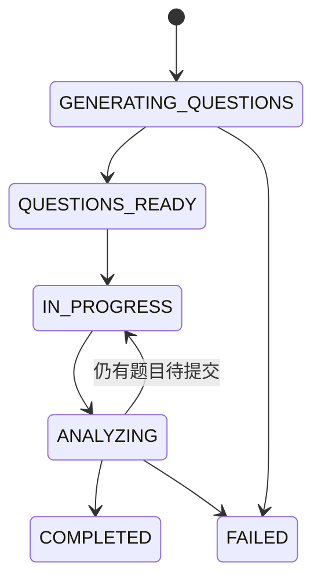

# 状态机与错误契约

## 1. Interview 状态



- API 是唯一允许改变状态的模块。
- `FAILED` 必须保留 `last_error`，重试后回到对应运行状态。
- Web 不根据答案数量自行推断状态。

## 2. Answer 状态

```text
PROCESSING -> COMPLETED
PROCESSING -> FAILED
FAILED     -> PROCESSING  （重试）
```

## 3. Job 状态

```text
QUEUED -> RUNNING -> SUCCEEDED
                 -> FAILED
```

Job 的 `error` 只允许在 `FAILED` 时非空。

## 4. 标准错误响应

```json
{
  "error": {
    "code": "ANALYSIS_NOT_READY",
    "message": "Answer analysis is still running.",
    "request_id": "uuid",
    "details": {}
  }
}
```

| HTTP | code | 使用场景 | 是否可重试 |
| --- | --- | --- | --- |
| 400 | `VALIDATION_ERROR` | 字段格式不合法 | 否，先修请求 |
| 404 | `INTERVIEW_NOT_FOUND` | 会话不存在 | 否 |
| 404 | `QUESTION_NOT_FOUND` | 问题不存在 | 否 |
| 404 | `ANSWER_NOT_FOUND` | 回答不存在 | 否 |
| 409 | `INVALID_STATE` | 当前状态不允许操作 | 视情况 |
| 409 | `ANALYSIS_NOT_READY` | 分析尚未完成 | 是，继续轮询 |
| 409 | `REPORT_NOT_READY` | 报告尚未完成 | 是，继续轮询 |
| 413 | `MEDIA_TOO_LARGE` | 文件超过限制 | 否，重新录制/压缩 |
| 415 | `UNSUPPORTED_MEDIA_TYPE` | 媒体格式不支持 | 否 |
| 422 | `MEDIA_UNREADABLE` | 文件损坏或无法解码 | 否，重新录制 |
| 502 | `MODEL_BAD_RESPONSE` | 模型未按契约输出 | 是，有限重试 |
| 503 | `DEPENDENCY_UNAVAILABLE` | 内部服务不可用 | 是，指数退避 |
| 504 | `MODEL_TIMEOUT` | 模型调用超时 | 是，有限重试 |

## 5. 重试规则

- GET 可安全重试。
- POST 只有携带相同 `Idempotency-Key` 时才可安全重试。
- 内部模型调用最多自动重试 2 次，退避 1 秒、3 秒。
- 验证错误、媒体损坏和不支持格式不得自动重试。
